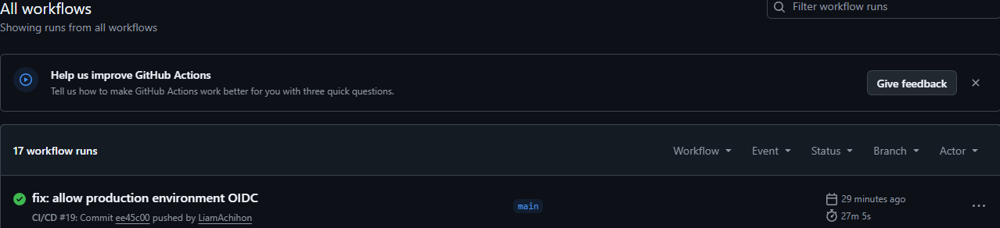
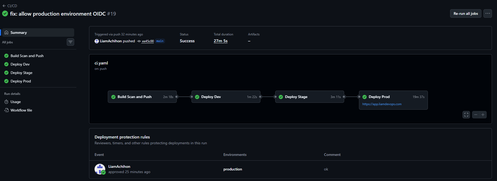
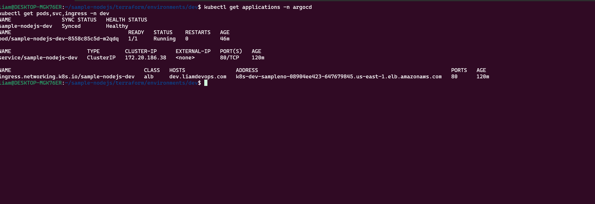
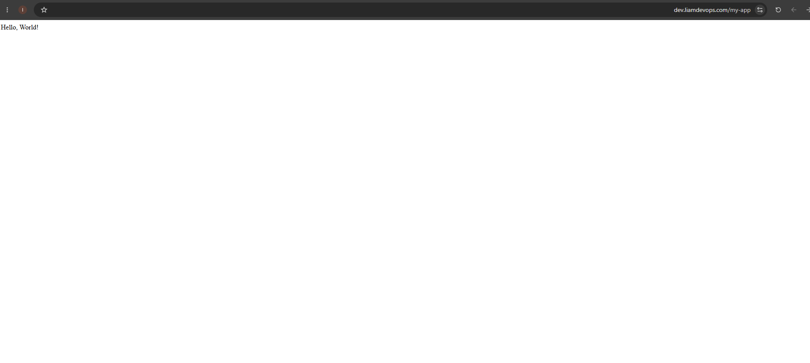
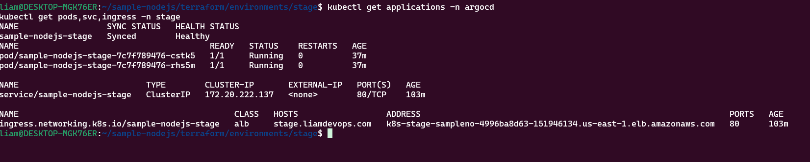
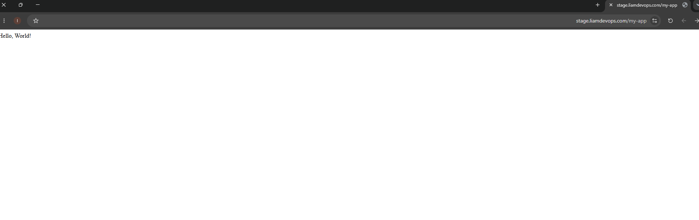
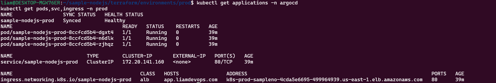
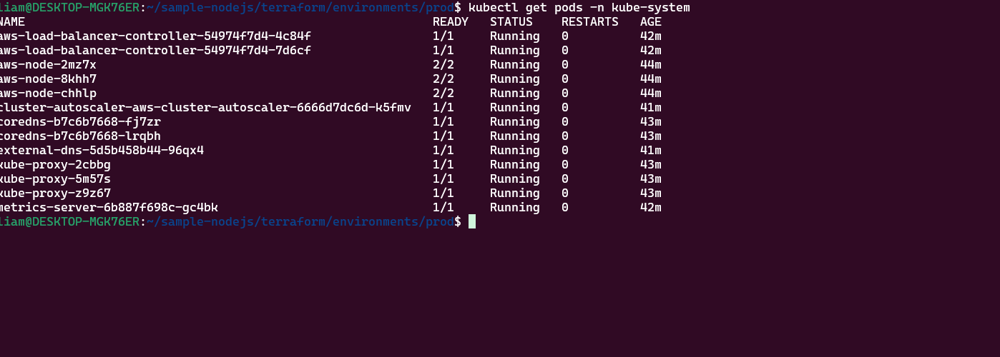
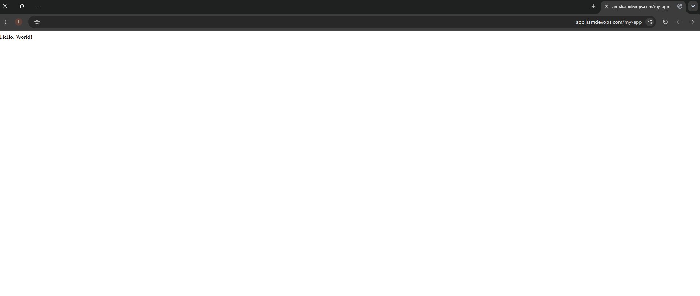

# Sample Node.js – EKS GitOps CI/CD

A DevOps/DevSecOps project that deploys a Node.js application to three AWS EKS environments:

- dev
- stage
- prod

## Stack

Terraform, AWS EKS, Amazon ECR, Helm, ArgoCD, GitHub Actions, Docker, Bearer, Trivy, Route 53, ACM and ALB.


## CI/CD Flow

```text
Build
  ↓
SAST
  ↓
Docker Build
  ↓
Trivy Scan
  ↓
Push to ECR
  ↓
Deploy Dev
  ↓
Deploy Stage
  ↓
Manual Approval
  ↓
Deploy Prod


## GitOps

ArgoCD reads the Helm chart directly from this repository and keeps the EKS cluster synchronized with Git.

```text
GitHub = Desired State
ArgoCD = Synchronization
EKS = Running State

ArgoCD uses automated sync, self-heal and prune.


Helm

The Helm chart is located in: helm/sample-nodejs

Environment values:
values-dev.yaml
values-stage.yaml
values-prod.yaml

The chart creates Deployment, Service, Ingress, HPA and ServiceAccount resources.


A Deployment was chosen because the application is stateless and does not require persistent storage or stable pod identities.


## Namespaces

Each environment uses a dedicated namespace:

```text
dev   → dev
stage → stage
prod  → prod


Examples:
kubectl get pods -n dev
kubectl get svc -n stage
kubectl get ingress -n prod


One-Time Setup

Create the Terraform state backend:

cd terraform/bootstrap
terraform init
terraform plan -out=bootstrap.tfplan
terraform apply bootstrap.tfplan


Create the shared infrastructure:
cd ../shared
terraform init
terraform plan -out=shared.tfplan
terraform apply shared.tfplan

After that, GitHub Actions can deploy dev, stage and prod automatically.


## Manual Dev Flow

Create the dev infrastructure:

```bash
cd terraform/environments/dev
terraform init
terraform plan -out=dev.tfplan
terraform apply dev.tfplan

Connect to the EKS cluster:

aws eks update-kubeconfig \
  --region us-east-1 \
  --name devops-k8s-task-dev-eks

Verify the connection:

kubectl config current-context
kubectl get nodes -o wide

Install the cluster add-ons:

cd ~/sample-nodejs
./scripts/install-addons.sh dev

Install ArgoCD:
./scripts/install-argocd.sh

Deploy the application:
kubectl apply \
  -f argocd/applications/sample-nodejs-dev.yaml


## Add-ons

The following add-ons are installed in every cluster:

- AWS Load Balancer Controller
- Metrics Server
- Cluster Autoscaler
- ExternalDNS

## Security

- Bearer blocks critical SAST findings
- Trivy blocks high and critical image vulnerabilities
- GitHub connects to AWS using OIDC
- No AWS access keys are stored in GitHub
- Production requires manual approval

## Domains

```text
dev   → dev.liamdevops.com
stage → stage.liamdevops.com
prod  → app.liamdevops.com
```

## Destroy Order

```text
prod
stage
dev
shared
bootstrap
```

## Submission Evidence

- Green GitHub Actions pipeline
- ArgoCD showing Synced and Healthy
- Application running through the public domain
- Kubernetes resources in the environment namespace
- Production job waiting for approval


---

## Deployment Evidence

### CI/CD Pipeline

All pipeline stages completed successfully:



### Production Manual Approval

Production deployment is protected by a GitHub Environment approval:



### Development Environment

ArgoCD is Synced and Healthy, and the Kubernetes resources are running:



Application access through Ingress:



### Stage Environment

ArgoCD is Synced and Healthy, and the Kubernetes resources are running:



Application access through Ingress:



### Production Environment

ArgoCD is Synced and Healthy, and the Kubernetes resources are running:



Production cluster add-ons:



Application access through Ingress:



---

## Smoke Tests

After every environment deployment, the pipeline validates:

1. Pod health through `localhost:8080/live`.
2. Service connectivity inside the cluster.
3. ALB and Ingress connectivity.
4. Public domain access through HTTPS.

A failed smoke test stops the pipeline and prevents deployment to the next environment.

---

## Deployment Strategy

The application uses a Kubernetes `Deployment` because it is stateless.

Rolling updates are configured with:

```yaml
maxUnavailable: 0
maxSurge: 1
